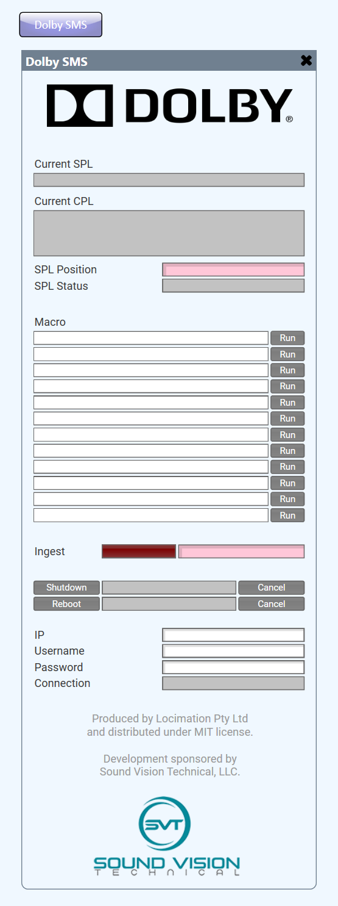

# Dolby SMS Plugin
*Development of this plugin was sponsored by Sound Vision Technical, LLC*

This plugin should has been tested against an IMS-2000, but should support:
 - DCP-2000
 - ShowVault/IMB
 - IMS-1000
 - IMS-2000
 - IMS-3000

It features:
 - Status Display of
    - Current SPL
    - Current CPL
    - SPL position / progress
    - SPL status (e.g. Playing / Paused)
    - Ingest in progress
 - An arbitrary number of macro controls
 - Shutdown & reboot commands (w/ 10-second delay)

 ---

## Open Source Development Program

Locimation Pty Ltd maintains an open-source development program for the benefit of the Q-Sys community.

Under this program, 3rd-party organisations may choose to sponsor the development of open-source projects, in exchange for a 50% discount on development costs.

Development sponsors are also entitled to a credit for their sponsorship in the software's user interface and source code, and to have their logo featured (alongside any other sponsors for the particular software), if desired.

### Terms

The resultant software remains the property of Locimation Pty Ltd, and Locimation Pty Ltd will hold the exclusive copyright to the software.

All software developed under this program will be distributed under MIT license via this repository.
