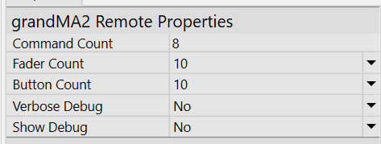
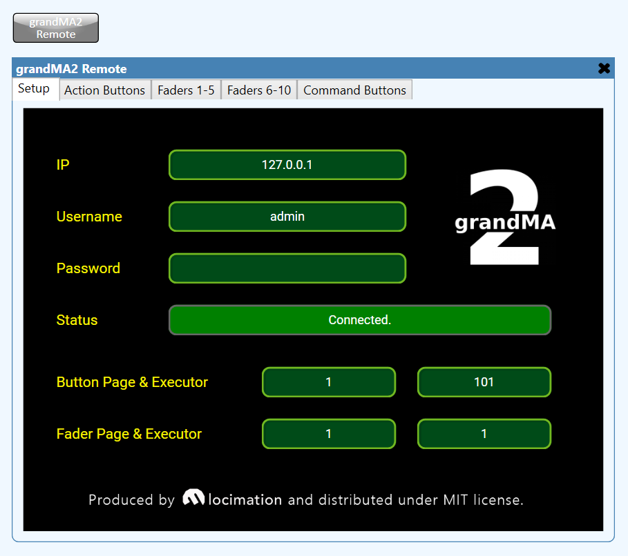
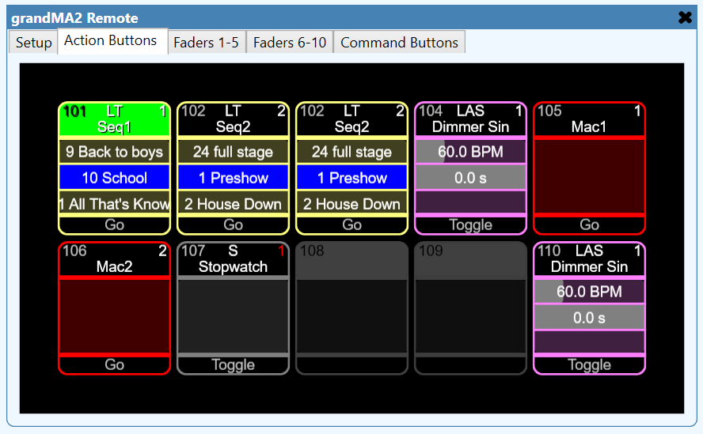
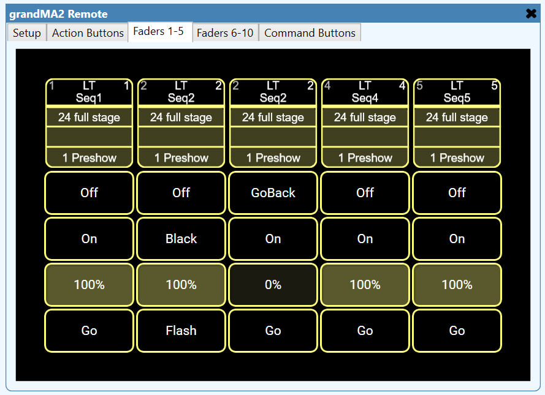
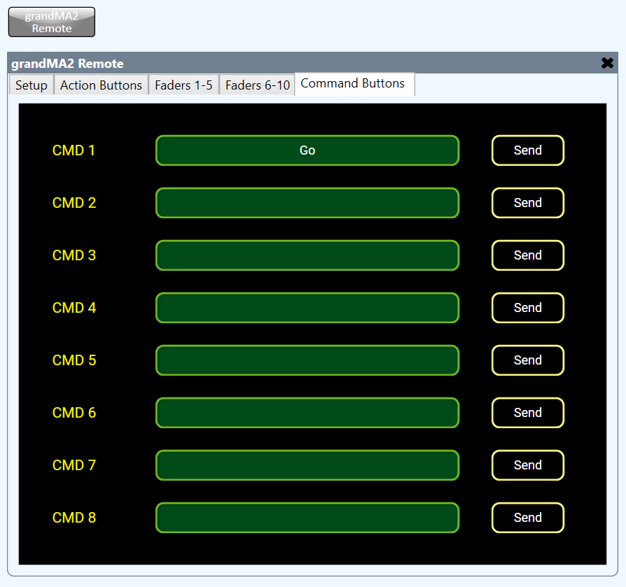

# MA2 Remote

This is a control plugin that enables Q-Sys to trigger action buttons, control fader executors, and execute arbitrary commands in a manner analagous to the built-in "Command Buttons".

## Properties

The plugin has configurable properties for operation:

1. **Command Count** - the number of pre-configured commands that can be executed on the "Command Buttons" tab of the plugin.
2. **Fader Count** - the number of fader executors available in the plugin.
3. **Button Count** - the number of action buttons available in the plugin.
4. Debug options - "Show Debug" will show basic debug information. "Verbose Debug" will show all messages to and from the web remote.

## Setup

In MA2, make sure the web remote is enabled:
 - go to Settings, Console, Global Settings
 - set Remotes to "Login Enabled"

In the plugin, specify the IP address of the MA2 instance (OnPC or console).
Enter a username and password to use with the web remote.

## Action Buttons

These buttons are dynamically assigned an SVG generated by the plugin, and clicking anywhere on the pool item will execute the button's assigned action.

*Note:* seperate actions on action buttons with width 2 or greater are not supported. This is a limitation of the web remote.

## Faders

MA2 Fader Executors are represented here in full - all assignable buttons (including for width > 2 executors) are available.

The fader value itself is represented in a compressed format due to the limitations of Q-Sys fader styling.

## Command Buttons

Command buttons function simialrly to the "Command Buttons" component built-in to Q-Sys, except for MA2 commands, rather than TCP, UDP or RS232.

Enter the command you wish to execute into the command field, then press the "Send" button.

Alternatively, connect a logic input to the corresponding control pin, e.g. `Command Buttons -> CMD 1 -> Send`.

