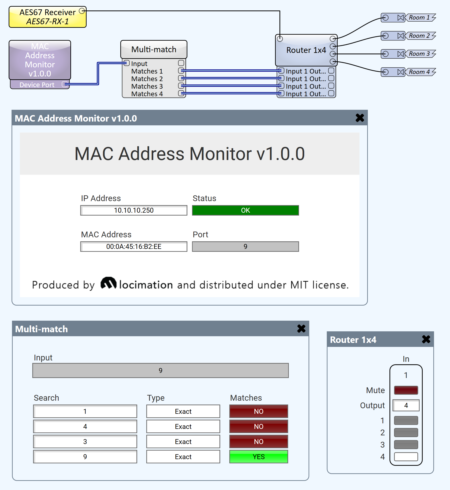

# MAC Address Monitor

  

This is a control plugin that enables Q-Sys to monitor the MAC address table of a device (typically, a network switch) in order to see which port a specified MAC address is reachable on.

This may be used to detect which network port a peripheral is connected to, and apply different logic depending on the result.

## Properties

The plugin has configurable properties for operation:

1. **Device Count** - the number of MAC addresses to monitor. 
2. **Packet Interval** - the interval between SNMP messages sent. 
3. **Show Debug** - enabling debug output will show the SNMP messages. 
4. **Community** - the SNMP v2 community name (usually "public")

## Setup

Ensure the switch has SNMPv2 enabled, and a "public" community with read access.

Specify the switch IP in the plugin controls.

Specify the MAC address(es) in the plugin controls.

## Usage

The plugin will indicate whether the network device (switch) is reachable in the "Status" control. If the device becomes unreachable, the status will become *Fault - not reachable*.

The plugin will indicate the interface number that the MAC address is detected on, on the "Port" control. Ordinarily, this will match the device's port labels. This is exposed as a control pin, e.g. "Device Port 1".

If the MAC address is not found on the switch, the "Port" display will show "Not Found".

## Example

This plugin pairs well with our [*Match*](https://github.com/locimation/qsys-plugins/tree/master/Logic) plugin (in "multi-match" mode), for use cases where different logic should be triggered by presence on different switch ports. See the example below:

