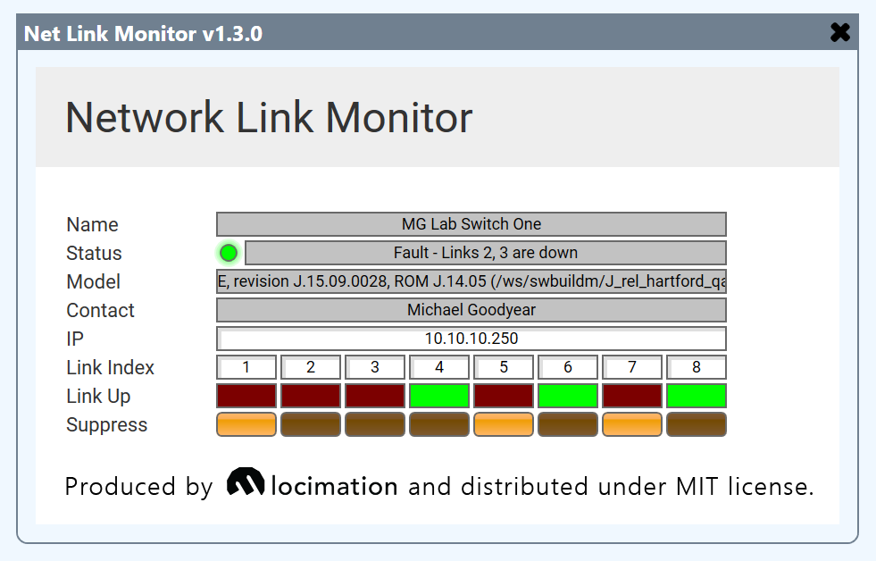

# Network Monitor

  

This is a control plugin that enables Q-Sys to monitor the reachability and operational link state of network devices (such as switches and routers) that make use if the IF-MIB and SNMP v2c.

## Properties

The plugin has configurable properties for operation:

1. **Link Count** - the number of network interfaces to monitor. 
*Note:* If a **Link Index** is not specified in the plugin controls, the interface will not be monitored.
2. **Poll Interval** - the interval between SNMP polls of each interface. Default: 0.3s
3. **Packet Interval** - the interval between SNMP packets sent to the device. *Note:* This must be low enough for the specified poll interval and link count, or else the SNMP queue will overrun.
4. **Community** - the SNMP v2 community name (usually "public")
5. **Show Debug** - enabling debug output will print the current SNMP queue length.

## Setup

Ensure the switch has SNMPv2 enabled, and a "public" community with read access.

Specify the switch IP in the plugin controls.

Specify the link indexes in the plugin controls. Ordinarily, these will match the switch port numbers, but this may vary from one model to another.

## Usage

The plugin will display the name, contact and model of the monitored device.

If the device becomes unreachable, the **reachable** LED will become false, and the status will become *Missing*.

Each network link's operational status will be indicated by the "Link Up" (rectangular) LED. Any configured link that is down will be reflected as a *Fault* in the device status.

If a link's state should not be reflected in the overall status, enable the corresponding **Suppress** button.
