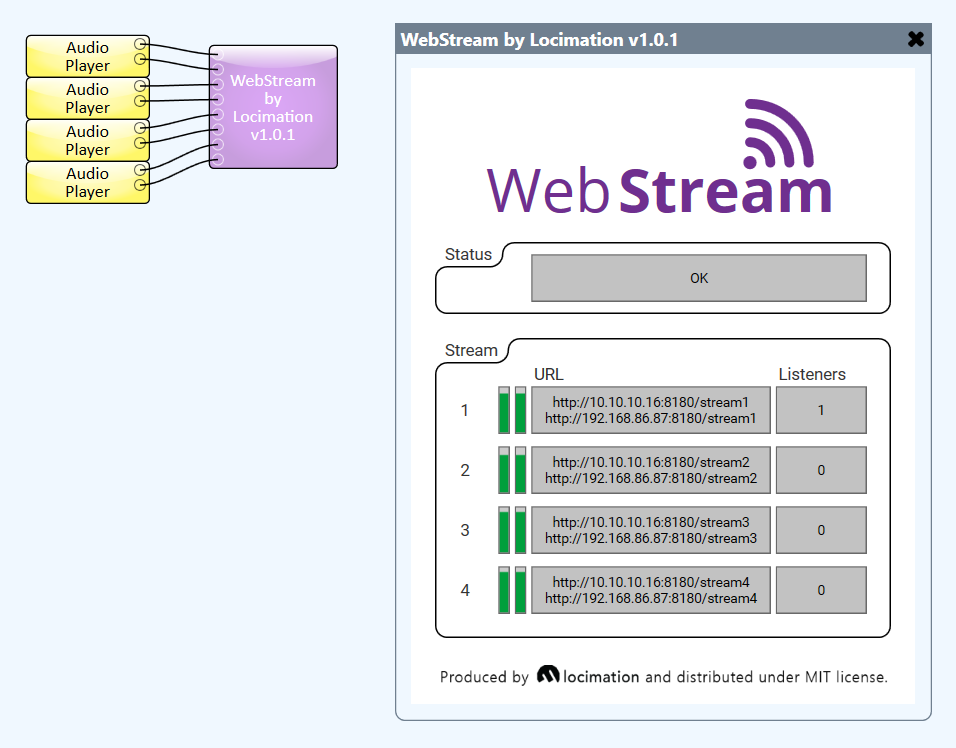

#
  

This plugin implements an HTTP MP3 streaming server.

It may be configured to serve between one and four independent stereo streams.

The server listens on all network interfaces.

## Properties

**Stream count** - the number of stereo streams to serve.

**Server port** - the webserver port to listen on for HTTP requests.

## Limitations

Internally, the plugin creates a Q-Sys Media Stream Transmitter to perform the audio compression.

As such, the number of distinct audio streams is limited by the maximum permissible media stream transmitters for the core model.

However, several users can listen to the same HTTP audio stream.

## Validation

Tested clients:

 - Google Chrome (86.0.4240.193)
 - Mozilla Firefox (82.0.3)
 - Mobile Safari (iOS 14.1)
 - VLC Media Player (3.0.8)
